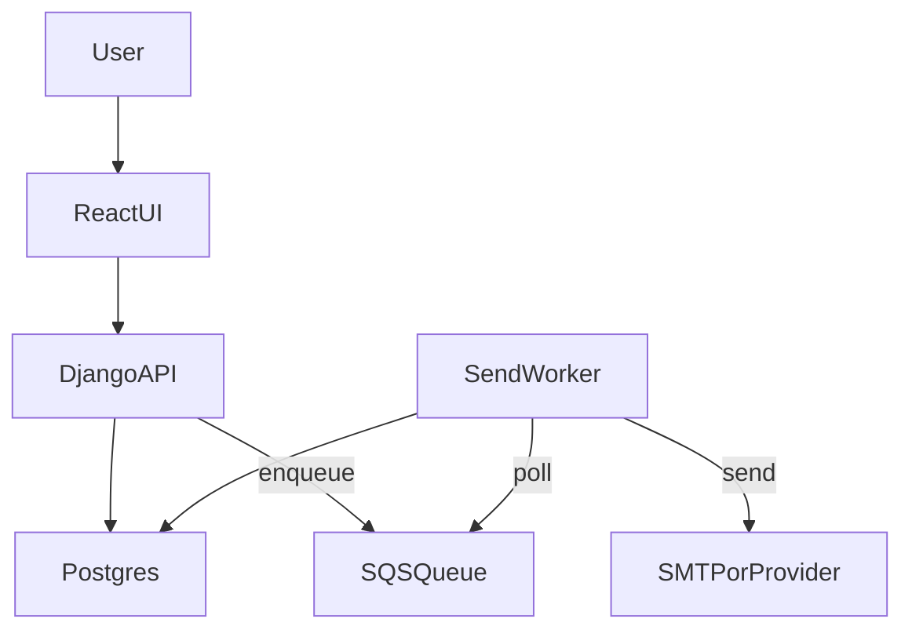

# Day-Wise Checklist (2 Weeks)

## Week 1: Core functionality

### Day 1 — Product skeleton
- Define core models: Campaign, Recipient, SendAttempt, Suppression, User.
- Decide template syntax: `{{field}}`.
- Define send states: draft, scheduled, sending, completed, failed.

### Day 2 — CSV import (backend)
- CSV upload endpoint.
- Field mapping and validation.
- Deduplicate by email and normalize.

### Day 3 — Merge + preview
- Merge engine in Django.
- Preview endpoint for one recipient.
- Unit tests for merge rules.

### Day 4 — Send engine (MVP)
- Send queue via management command or worker loop.
- Throttling (for example, 20 per minute).
- Basic retry logic and status tracking.

### Day 5 — Open tracking and unsubscribe
- Integrate open-tracking endpoint.
- Add unsubscribe endpoint and suppression list.
- Add `[unsubscribe]` placeholder in template.

### Day 6 — Dashboard stats (backend)
- Aggregates: sent, delivered, opened.
- Campaign detail endpoint.

### Day 7 — React UI (auth + campaign list)
- Login and signup.
- Campaign list and status display.

## Week 2: UX, testing, deploy

### Day 8 — React UI (create/edit campaign)
- Create campaign form.
- CSV upload and field mapping.
- Template editor and preview.

### Day 9 — React UI (send flow)
- Schedule or send-now UI.
- Show progress and stats.

### Day 10 — Tests
- Unit tests for merge, open tracking, unsubscribe.
- Integration test for send pipeline (mock email backend).

### Day 11 — Deployment
- Dockerize backend and frontend.
- Deploy to free tiers (Render/Railway + Vercel/Netlify).
- Configure environment variables.

### Day 12 — Observability
- Basic logging and error reporting (Sentry free tier).
- Admin panel access for debugging.

### Day 13 — Documentation
- README: setup, features, screenshots, architecture.
- Add limitations and future work section.

### Day 14 — Portfolio polish
- Demo video or GIF.
- Public URL and example dataset.
- Short case study: problem, design, tradeoffs.

## Architecture Diagram

