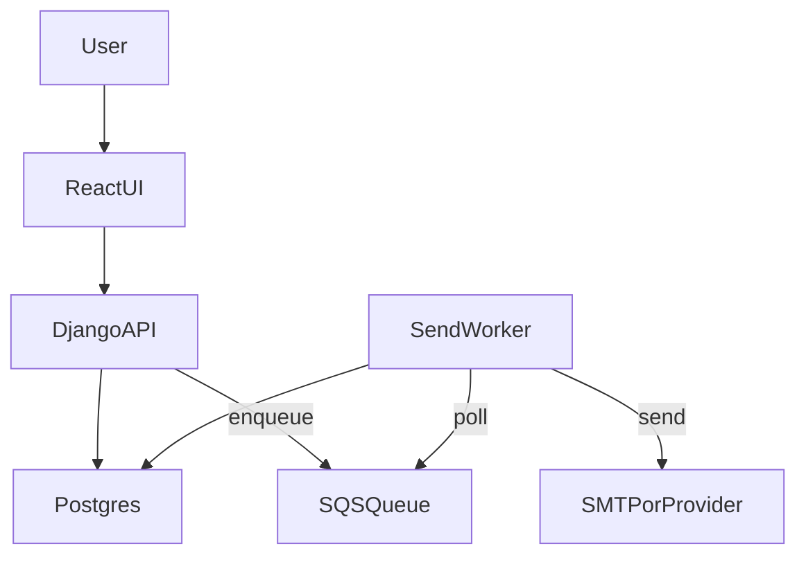

# Two-Week Mail Merge Plan

## Decisions

- Queue: AWS SQS with long-polling + a Django management-command worker (simpler than Celery, minimal ops, pay-per-request).
- Plan doc location: `notes/plan.md`.
- Plan doc should be gitignored so it won’t appear on GitHub.

## AWS SQS guidance (time/cost)

- **Pros**: low operational overhead, no always-on broker, predictable cost (pay per request), easy to scale.
- **Cons**: you must implement worker loop, backoff, and visibility-timeout handling yourself.
- **Why it fits**: with a 2-week timeline and low-cost target, SQS + management command avoids Celery/Redis overhead while still enabling reliable async sends.

## Files to add/update

- Create `[notes/plan.md](notes/plan.md)` with the 14-day checklist, feature scope, and deployment/testing notes.
- Update `[.gitignore](.gitignore)` to ignore the plan doc (e.g., `notes/plan.md`).

## Plan content outline (to be written into `notes/plan.md`)

- **Goal & scope**: portfolio-ready, minimal product, 2–3 hours/day.
- **Feature checklist**: auth, CSV import, merge + preview, send pipeline, open tracking, unsubscribe, stats, tests, deploy.
- **14-day schedule**: day-by-day tasks (Days 1–14) with checkpoints.
- **Queue design**: SQS message shape, worker loop, retry policy, visibility timeout.
- **Cost strategy**: free-tier hosting + low-volume email provider.
- **Risks & mitigation**: deliverability limits, rate limiting, open tracking limitations.

## Implementation steps

1. Draft `notes/plan.md` with the 2-week checklist and the SQS-based worker approach.
2. Add `notes/plan.md` to `.gitignore` so it is not tracked or pushed.
3. Review the plan text for clarity and alignment with time/cost constraints.

## Optional diagram to include in plan (if desired)

